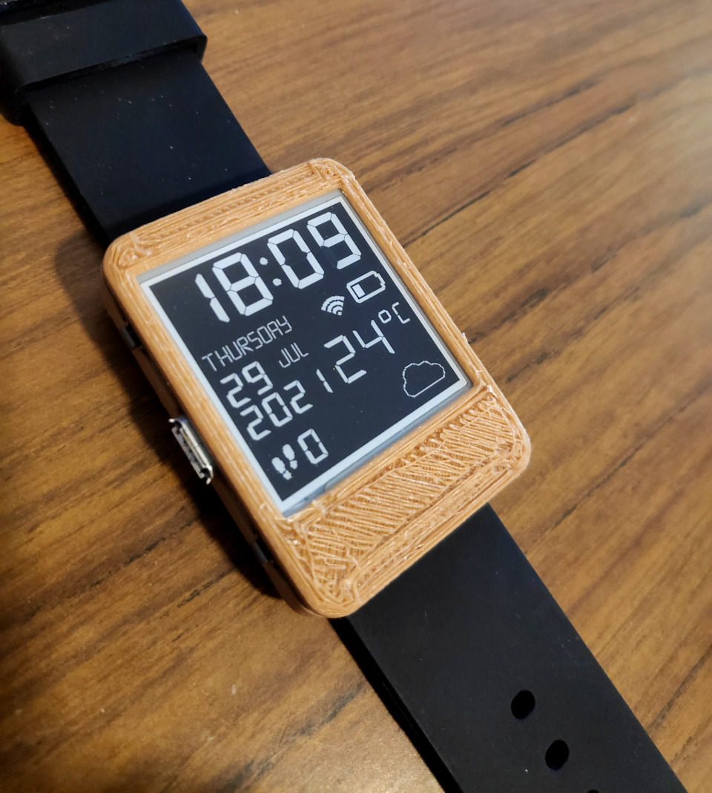

# Case design for the Watchy open source watch
Designed using [CadQuery](https://github.com/CadQuery/cadquery) by Gilad Dayagi.

Includes a case body and top cover.  
Use two screws to attach the fastener to the body.  
Designed for use with 24mm straps.
Adjust the parameters at the top for your needs.  

Note:
As the screen is placed manually the top may not fit exactly - adjust the `p_screen_from_pcb_top` parameter to suit your copy.

See photos folder for more photos.
